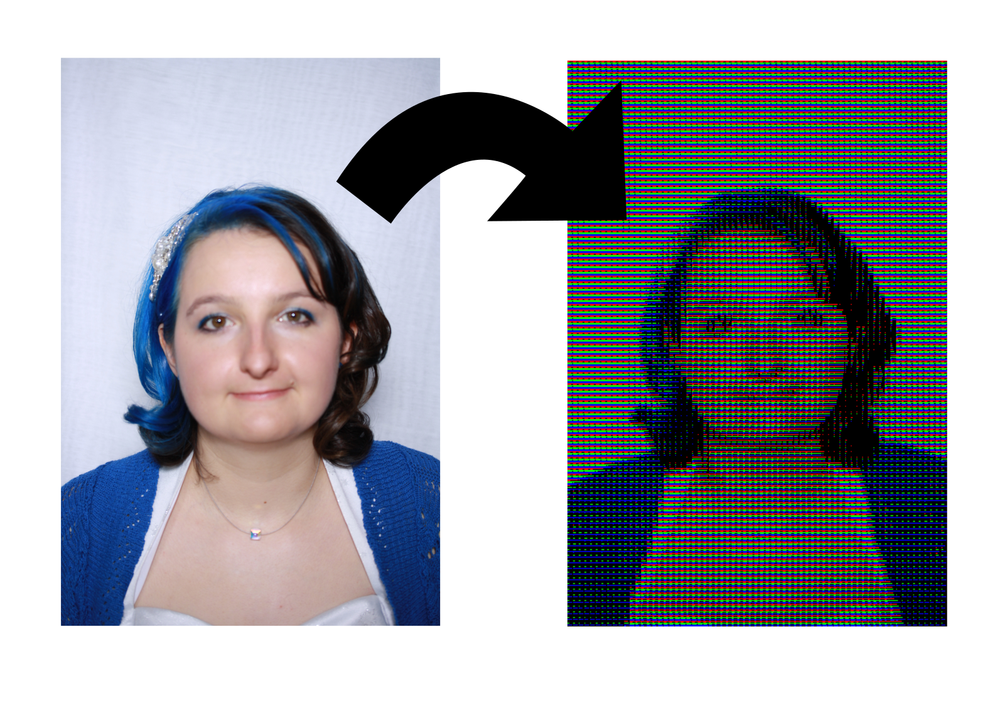

# Manchester Mega Pixel Photobooth

This repo contains part of the code for a photobooth built for Manchester Science Festival in 2016. This code edits the photographs taken to produce an image constructed solely from red, green, blue, and black squares. This is to help communicate the way LED screens work.
